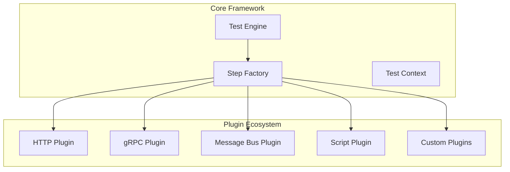
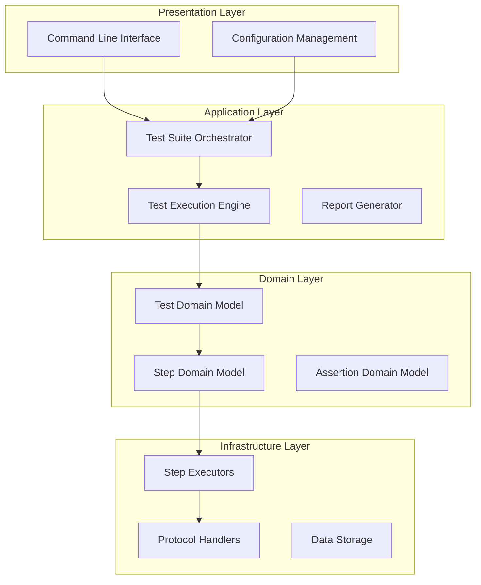

# Architecture Documentation
## Enterprise YAML-Based Testing Framework

This directory contains comprehensive architectural documentation, diagrams, and design decisions for the enterprise testing framework.

---

## 📁 Directory Structure

```
architecture/
├── README.md                    # This file - architecture overview
├── diagrams/                    # Visual architecture representations
│   ├── system-overview.md       # High-level system architecture
│   ├── component-diagram.md     # Detailed component relationships
│   ├── sequence-diagrams.md     # Execution flow diagrams
│   └── deployment-diagram.md    # Deployment and scaling architecture
├── decisions/                   # Architecture Decision Records (ADRs)
│   ├── 001-plugin-architecture.md
│   ├── 002-yaml-configuration.md
│   ├── 003-performance-monitoring.md
│   └── 004-multi-protocol-support.md
└── extensions/                  # Extension and customization guides
    ├── custom-step-types.md     # How to add new step types
    ├── custom-assertions.md     # Creating custom assertions
    └── protocol-extensions.md   # Adding new protocol support
```

---

## 🏗️ Architectural Principles

### 1. **Extensibility First**
The framework is designed with extensibility as the primary architectural concern:
- **Plugin-based architecture** allows new functionality without core modifications
- **Interface-driven design** enables clean separation of concerns
- **Factory patterns** provide automatic type detection and instantiation

### 2. **Performance by Design**
Performance considerations are built into every architectural decision:
- **Asynchronous execution** for high-throughput scenarios
- **Memory-efficient processing** for large datasets
- **Built-in performance monitoring** at every execution level

### 3. **Enterprise Readiness**
The architecture addresses enterprise-scale requirements:
- **Horizontal scalability** through distributed execution support
- **Robust error handling** with sophisticated retry mechanisms
- **Comprehensive observability** with detailed logging and metrics

### 4. **Developer Experience**
Balancing power with usability:
- **YAML-based configuration** for accessibility
- **Comprehensive documentation** and examples
- **Intuitive API design** following established patterns

---

## 🎯 Core Architectural Patterns

### Plugin Architecture


### Layered Architecture


---

## 🔧 Key Design Decisions

### ADR-001: Plugin-Based Architecture
**Decision**: Implement a plugin-based architecture for step executors
**Rationale**: Enables extensibility without core framework modifications
**Impact**: New protocols and step types can be added independently

### ADR-002: YAML Configuration Format
**Decision**: Use YAML as the primary configuration format
**Rationale**: Human-readable, widely adopted, supports complex data structures
**Impact**: Lower barrier to entry while maintaining enterprise capabilities

### ADR-003: Built-in Performance Monitoring
**Decision**: Integrate performance monitoring into the core execution engine
**Rationale**: Enables performance testing alongside functional testing
**Impact**: Unified tooling reduces complexity and improves adoption

### ADR-004: Multi-Protocol Support
**Decision**: Support multiple communication protocols in a single framework
**Rationale**: Modern applications use diverse communication patterns
**Impact**: Comprehensive testing capabilities in a single tool

---

## 📊 Scalability Considerations

### Horizontal Scaling
The framework is designed for distributed execution:
- **Stateless execution nodes** enable easy horizontal scaling
- **Shared context management** through external storage
- **Load balancing** for optimal resource utilization

### Performance Optimization
- **Connection pooling** for network protocols
- **Streaming processing** for large datasets
- **Lazy loading** of test definitions and resources
- **JIT compilation** for expression evaluation

### Resource Management
- **Memory-efficient processing** prevents resource exhaustion
- **Graceful degradation** under high load conditions
- **Automatic cleanup** of resources and connections

---

## 🛡️ Quality Assurance

### Error Handling Strategy
- **Comprehensive exception handling** at all levels
- **Graceful failure modes** with detailed diagnostics
- **Retry mechanisms** with configurable policies
- **Circuit breaker patterns** for external dependencies

### Testing Strategy
- **Unit tests** for all core components
- **Integration tests** for protocol handlers
- **Performance tests** for scalability validation
- **End-to-end tests** for complete workflow validation

### Monitoring & Observability
- **Structured logging** with correlation IDs
- **Performance metrics** collection and analysis
- **Health checks** for system components
- **Distributed tracing** support

---

## 🚀 Future Architecture Evolution

### Planned Enhancements
1. **Cloud-Native Deployment** - Kubernetes-native execution
2. **Real-Time Analytics** - Live performance dashboards
3. **AI-Powered Optimization** - Intelligent test optimization
4. **Advanced Security** - Zero-trust security model

### Extension Points
- **Custom Protocol Support** - Framework for new communication protocols
- **Advanced Assertions** - Domain-specific validation logic
- **Custom Reporters** - Specialized output formats
- **Integration Adapters** - Third-party tool integration

---

*This architectural documentation demonstrates the sophisticated design thinking and enterprise-grade considerations that went into building a scalable, maintainable, and extensible testing framework.*
