# Performance & Scalability Analysis
## Enterprise YAML-Based Testing Framework

This document demonstrates the sophisticated performance engineering and scalability considerations built into the testing framework, showcasing enterprise-grade architectural decisions.

---

## 🚀 Performance Architecture Overview

### Built-in Performance Monitoring

The framework includes **comprehensive performance monitoring** at every execution level, enabling both functional and performance testing in a unified platform.

```mermaid
graph TB
    subgraph "Performance Monitoring Stack"
        A[Test Suite Level] --> B[Test Level]
        B --> C[Step Level]
        C --> D[Protocol Level]
        D --> E[System Level]
    end
    
    subgraph "Metrics Collection"
        F[Execution Time] --> G[Memory Usage]
        G --> H[Network Latency]
        H --> I[Throughput]
        I --> J[Error Rates]
    end
    
    subgraph "Analysis & Reporting"
        K[Real-time Dashboards] --> L[Trend Analysis]
        L --> M[Threshold Validation]
        M --> N[Performance Regression Detection]
    end
```



### Performance Data Model

```csharp
// What the framework actually exposes per step
public class ExecutionResult
{
    public DateTime StartTime { get; set; }
    public DateTime EndTime { get; set; }
    public long ExecutionTimeMs { get; set; }
    public long AssertionTimeMs { get; set; }
    public string StepType { get; set; }
}

// These metrics are surfaced into the TestContext so you can assert them via JPath:
// $curStep:performance.executionTimeMs
// $curStep:performance.assertionTimeMs
// $curStep:performance.startTime
// $curStep:performance.endTime
// $curStep:performance.stepType

// In addition, some step types publish protocol-specific metrics via $curStep:performanceData.*
// (e.g., for message bus steps: publishTimeMs, subscribeTimeMs, messageSize).
```

---

## 📊 Performance Testing Capabilities

### 1. Threshold-Based Performance Validation

```yaml
# Example: API Performance Validation
- Name: "API Response Time Validation"
  Type: "http"
  Input:
    Method: "GET"
    RequestUri: "{{$var:apiEndpoint}}/users"
  
  Asserters:
    # Functional validation
    - AssertEq:
        JPathExpr: "$curStep:output.statusCode"
        ConstExpr: 200
    
    # Performance thresholds
    - AssertLt:
        JPathExpr: "$curStep:performance.executionTimeMs"
        ConstExpr: 500
        ErrorMessage: "API response must be under 500ms"
    
    - AssertLt:
        JPathExpr: "$curStep:performance.networkTimeMs"
        ConstExpr: 200
        ErrorMessage: "Network latency must be under 200ms"
    
    # Memory efficiency validation
    - AssertLt:
        JPathExpr: "$curStep:performance.memoryUsageBytes"
        ConstExpr: 10485760  # 10MB
        ErrorMessage: "Memory usage must be under 10MB"
```

### 2. Load Testing with Concurrent Execution

```yaml
# Example: Concurrent Load Testing
Name: "Concurrent API Load Test"
Tables:
  - Name: "ConcurrencyLevels"
    Data:
      - users: 10
        duration: 30
        expected_rps: 100
      - users: 50
        duration: 60
        expected_rps: 400
      - users: 100
        duration: 120
        expected_rps: 700

RepeatFor:
  Table: "ConcurrencyLevels"

Steps:
  - Name: "Load Test - {{$table:users}} Users"
    Type: "script"
    Input:
      Language: "python"
      Parameters:
        concurrent_users: "{{$table:users}}"
        test_duration: "{{$table:duration}}"
        target_rps: "{{$table:expected_rps}}"
      Script: |
        # Advanced load testing with performance analytics
        import asyncio
        import aiohttp
        import time
        import statistics
        
        async def performance_load_test():
            # Implementation with detailed metrics collection
            # ... (detailed implementation)
            
            metrics = {
                'requests_per_second': actual_rps,
                'avg_response_time': avg_time,
                'p95_response_time': p95_time,
                'p99_response_time': p99_time,
                'error_rate': error_rate,
                'throughput_mbps': throughput
            }
            
            print("RESULT_JSON:" + json.dumps(metrics))
    
    Asserters:
      - AssertGte:
          JPathExpr: "$curStep:output.parsed.requests_per_second"
          ConstExpr: "{{$table:expected_rps}}"
          ErrorMessage: "Should meet RPS target"
```

### 3. Performance Regression Testing

```yaml
# Example: Performance Baseline Comparison
- Name: "Performance Regression Check"
  Type: "script"
  Input:
    Language: "python"
    Parameters:
      current_metrics: "{{$var:currentPerformanceData}}"
      baseline_metrics: "{{$var:baselinePerformanceData}}"
      tolerance_percent: "10"
    Script: |
      import json
      import os
      
      current = json.loads(os.environ.get('current_metrics'))
      baseline = json.loads(os.environ.get('baseline_metrics'))
      tolerance = float(os.environ.get('tolerance_percent', '10'))
      
      def calculate_regression(current_val, baseline_val, tolerance):
          if baseline_val == 0:
              return {'regression': False, 'change_percent': 0}
          
          change_percent = ((current_val - baseline_val) / baseline_val) * 100
          regression = change_percent > tolerance
          
          return {
              'regression': regression,
              'change_percent': round(change_percent, 2),
              'current_value': current_val,
              'baseline_value': baseline_val,
              'threshold': tolerance
          }
      
      analysis = {
          'response_time': calculate_regression(
              current['avg_response_time'],
              baseline['avg_response_time'],
              tolerance
          ),
          'throughput': calculate_regression(
              baseline['requests_per_second'],  # Inverted for throughput
              current['requests_per_second'],
              tolerance
          ),
          'memory_usage': calculate_regression(
              current['memory_usage'],
              baseline['memory_usage'],
              tolerance
          )
      }
      
      # Overall regression status
      analysis['overall_regression'] = any(
          metric['regression'] for metric in analysis.values()
      )
      
      print("RESULT_JSON:" + json.dumps(analysis, indent=2))
  
  Asserters:
    - AssertEq:
        JPathExpr: "$curStep:output.parsed.overall_regression"
        ConstExpr: false
        ErrorMessage: "Performance regression detected"
```

---

## 🏗️ Scalability Considerations (Current Scope)

This framework runs as a single-process test runner. Scalability today means:
- Running suites efficiently within one process
- Keeping per-step overhead minimal (capturing timing data without heavy instrumentation)
- Allowing data-driven batches via tables/repeaters to cover large scenarios

What is intentionally not claimed here:
- No built-in distributed execution across nodes
- No cluster manager or load balancer integration

If you need parallelism, use OS/process-level parallel runs (e.g., split suites across CI jobs) — the runner’s output is designed to be aggregatable by external tooling.
### Memory Optimization Strategies

```csharp
// Streaming JSON processing for large datasets
public class StreamingJsonProcessor
{
    public async Task<IEnumerable<T>> ProcessLargeDataset<T>(Stream jsonStream)
    {
        using var reader = new JsonTextReader(new StreamReader(jsonStream));
        var serializer = new JsonSerializer();
        
        // Process items one at a time without loading entire dataset
        while (await reader.ReadAsync())
        {
            if (reader.TokenType == JsonToken.StartObject)
            {
                var item = serializer.Deserialize<T>(reader);
                yield return item;
            }
        }
    }
}

// Object pooling for expensive resources
public class HttpClientPool
{
    private readonly ConcurrentQueue<HttpClient> _clients = new();
    private readonly SemaphoreSlim _semaphore;
    
    public async Task<HttpClient> GetClientAsync()
    {
        await _semaphore.WaitAsync();
        
        if (_clients.TryDequeue(out var client))
            return client;
        
        return CreateNewClient();
    }
    
    public void ReturnClient(HttpClient client)
    {
        _clients.Enqueue(client);
        _semaphore.Release();
    }
}
```

### Asynchronous Execution Framework

```csharp
public class AsyncTestExecutor
{
    private readonly SemaphoreSlim _concurrencyLimiter;
    
    public async Task<IEnumerable<TestResult>> ExecuteTestsAsync(
        IEnumerable<Test> tests, 
        int maxConcurrency = 10)
    {
        _concurrencyLimiter = new SemaphoreSlim(maxConcurrency);
        
        var tasks = tests.Select(async test =>
        {
            await _concurrencyLimiter.WaitAsync();
            try
            {
                return await ExecuteTestAsync(test);
            }
            finally
            {
                _concurrencyLimiter.Release();
            }
        });
        
        return await Task.WhenAll(tasks);
    }
    
    private async Task<TestResult> ExecuteTestAsync(Test test)
    {
        // Asynchronous test execution with proper resource management
        using var cancellationTokenSource = new CancellationTokenSource(TimeSpan.FromMinutes(30));
        
        try
        {
            return await test.ExecuteAsync(cancellationTokenSource.Token);
        }
        catch (OperationCanceledException)
        {
            return TestResult.Timeout(test.Name);
        }
    }
}
```

---

## 📈 Performance Monitoring & Analytics

The runner exposes per-step metrics (executionTimeMs, assertionTimeMs, start/end time, stepType) into the TestContext. You can:
- Assert thresholds directly in YAML (e.g., executionTimeMs under a target)
- Emit machine-readable outputs (e.g., JUnit/XML/JSON) via your pipeline scripts
- Post-process the collected metrics to produce dashboards in your preferred tool (e.g., Grafana, Power BI)

Example assertion:

```yaml
Asserters:
  - AssertLt:
      JPathExpr: "$curStep:performance.executionTimeMs"
      ConstExpr: 800
      ErrorMessage: "Step should complete within 800ms"
```


---

## 🎯 Operational Considerations

- Resource Management: Use connection pooling where applicable; avoid expensive per-step allocations
- Performance Optimization: Cache compiled expressions/config where safe; prefer lazy loading
- Observability: Log execution timings and assertion failures; export results for CI reporting
- Parallelization: Run multiple suites in parallel at the job level (outside the runner) if needed
---

## 📊 How To Measure Performance Yourself

Rather than quoting synthetic benchmarks, this project encourages measuring in your environment:

1) Add threshold assertions to critical steps
- Assert executionTimeMs (and protocol-specific metrics if available)

2) Capture results in CI
- Export JSON/JUnit and retain as build artifacts

3) Track regressions
- Compare current metrics to a saved baseline using a simple script step

---

This section focuses on actionable guidance so results are reproducible and relevant to your workload.
