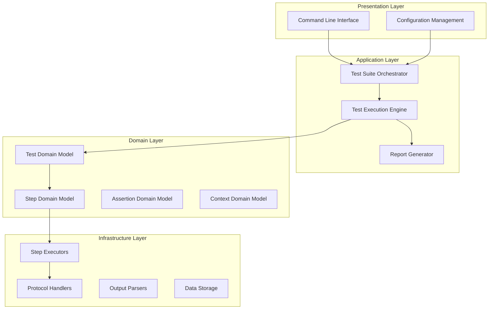
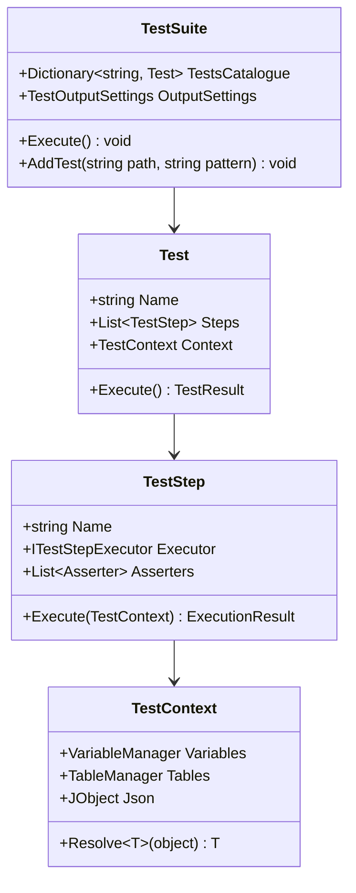
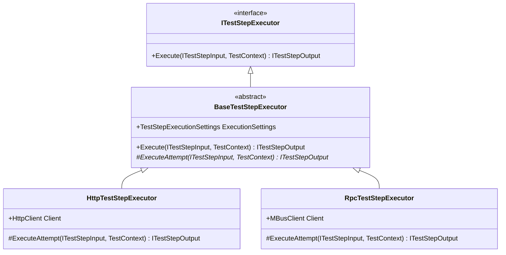
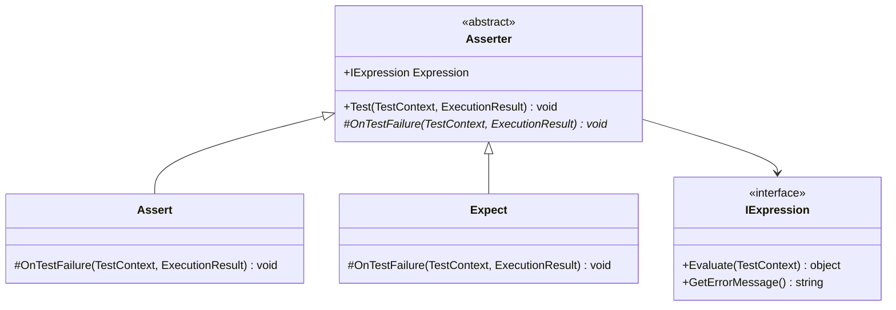

# Technical Architecture Documentation
## Enterprise YAML-Based Testing Framework

---

## 🏗️ System Architecture Overview

The TestRunner framework implements a **layered, plugin-based architecture** designed for enterprise scalability, maintainability, and extensibility. The system follows **Domain-Driven Design (DDD)** principles with clear bounded contexts and separation of concerns.

### High-Level Architecture



---

## 🎯 Core Design Patterns

### 1. Factory Method Pattern
**Implementation**: `TestStepFactory` with automatic type detection

```csharp
public static class TestStepFactory
{
    public static TestStep Create(JToken stepDefinition)
    {
        // Automatic type detection based on input properties
        var input = stepDefinition["Input"];
        
        if (input["Method"] != null || input["RequestUri"] != null)
            return HttpTestStepFactory.Create(stepDefinition);
        else if (input["ProtoTypeName"] != null)
            return RpcTestStepFactory.Create(stepDefinition);
        // ... additional type detection logic
    }
}
```

**Benefits**:
- Zero configuration step creation
- Extensible without modifying core code
- Type-safe step instantiation

### 2. Strategy Pattern
**Implementation**: `ITestStepExecutor` interface with protocol-specific implementations

```csharp
public interface ITestStepExecutor
{
    ITestStepOutput Execute(ITestStepInput input, TestContext context);
}

// Concrete implementations
public class HttpTestStepExecutor : BaseTestStepExecutor<HttpTestStepOutputSettings>
public class RpcTestStepExecutor : BaseTestStepExecutor<RpcTestStepOutputSettings>
public class ScriptTestStepExecutor : BaseTestStepExecutor<ScriptTestStepOutputSettings>
```

**Benefits**:
- Pluggable execution strategies
- Protocol-specific optimizations
- Easy addition of new protocols

### 3. Template Method Pattern
**Implementation**: `BaseTestStepExecutor` with retry and error handling

```csharp
public abstract class BaseTestStepExecutor<T> : ITestStepExecutor
{
    public ITestStepOutput Execute(ITestStepInput input, TestContext context)
    {
        // Template method with retry logic
        for (int attempt = 1; attempt <= maxRetries; attempt++)
        {
            try
            {
                var result = ExecuteAttempt(input, context);
                if (ShouldRetry(result)) continue;
                return result;
            }
            catch (Exception ex) when (attempt < maxRetries)
            {
                // Retry logic
            }
        }
    }
    
    protected abstract ITestStepOutput ExecuteAttempt(ITestStepInput input, TestContext context);
}
```

---

## 🔧 Component Architecture

### Test Execution Engine



### Step Execution Framework



---

## 🎨 Advanced Features Architecture

### 1. Dynamic Variable Resolution System

```csharp
public class JPathResolver
{
    public JToken Resolve(object value)
    {
        if (value is string str && str.Contains("{{"))
        {
            return ResolveVariableExpression(str);
        }
        return ProcessComplexObject(value);
    }
    
    private JToken ResolveVariableExpression(string expression)
    {
        // Supports: {{$var:name}}, {{$curStep:path}}, {{$table:name[index].field}}
        var match = VariablePattern.Match(expression);
        return match.Success ? EvaluateExpression(match) : JToken.FromObject(expression);
    }
}
```

### 2. Assertion Framework Architecture



### 3. Performance Monitoring Integration

```csharp
public class StepPerformanceData
{
    public long ExecutionTimeMs { get; set; }
    public long AssertionTimeMs { get; set; }
    public DateTime StartTime { get; set; }
    public DateTime EndTime { get; set; }
    public Dictionary<string, object> CustomMetrics { get; set; }
}

// Performance data is automatically captured and made available to assertions
public void CapturePerformanceMetrics(TestStep step, TestContext context)
{
    var performanceData = new JObject
    {
        ["executionTimeMs"] = step.ExecResult.ExecutionTimeMs,
        ["assertionTimeMs"] = step.ExecResult.AssertionTimeMs,
        ["startTime"] = step.ExecResult.StartTime,
        ["endTime"] = step.ExecResult.EndTime
    };
    context.SetValueToStep(step.Id, "performance", performanceData);
}
```

---

## 🔄 Extensibility Points

### 1. Custom Step Types
```csharp
// 1. Implement the executor interface
public class CustomStepExecutor : BaseTestStepExecutor<CustomOutputSettings>
{
    protected override ITestStepOutput ExecuteAttempt(ITestStepInput input, TestContext context)
    {
        // Custom execution logic
    }
}

// 2. Register in the factory
public static class TestStepFactory
{
    static TestStepFactory()
    {
        RegisterStepType("custom", () => new CustomStepExecutor());
    }
}
```

### 2. Custom Assertions
```csharp
public class CustomAssertion : Asserter
{
    public CustomAssertion(IExpression expression) : base(expression) { }
    
    protected override void OnTestFailure(TestContext context, ExecutionResult result)
    {
        // Custom failure handling
    }
}
```

### 3. Custom Output Parsers
```csharp
public class CustomOutputParser : IOutputParser
{
    public JObject Parse(string output, ParserConfiguration config)
    {
        // Custom parsing logic
    }
}
```

---

## 📊 Performance Considerations

### Memory Management
- **Streaming JSON Processing**: Large datasets processed without loading entire content into memory
- **Object Pooling**: Reuse of expensive objects like HTTP clients
- **Lazy Loading**: Test definitions loaded on-demand

### Execution Optimization
- **Parallel Execution**: Support for concurrent test execution
- **Connection Pooling**: Efficient resource utilization for network protocols
- **Caching**: Intelligent caching of parsed configurations and compiled expressions

### Scalability Features
- **Horizontal Scaling**: Framework designed for distributed execution
- **Resource Isolation**: Clean separation between test contexts
- **Graceful Degradation**: Robust error handling with partial failure support

---

## 🛡️ Quality Assurance

### Error Handling Strategy
```csharp
public class RobustExecutionWrapper
{
    public async Task<T> ExecuteWithRetry<T>(Func<Task<T>> operation, RetryPolicy policy)
    {
        for (int attempt = 1; attempt <= policy.MaxRetries; attempt++)
        {
            try
            {
                return await operation();
            }
            catch (Exception ex) when (policy.ShouldRetry(ex, attempt))
            {
                await Task.Delay(policy.GetDelay(attempt));
            }
        }
        throw new MaxRetriesExceededException();
    }
}
```

### Logging and Observability
- **Structured Logging**: JSON-formatted logs with correlation IDs
- **Performance Metrics**: Built-in performance monitoring
- **Trace Capabilities**: Detailed execution tracing for debugging
- **Health Checks**: Framework health monitoring and diagnostics

---

*This architecture demonstrates enterprise-grade software design with emphasis on maintainability, extensibility, and performance.*
